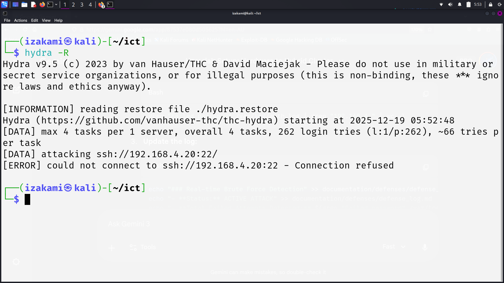

# Red Team Operation: SSH Brute Force Simulation
**Target IP:** 192.168.4.20
**Attacker IP:** 192.168.4.11
**Date:** 2025-12-19

## Phase 1: Service Discovery
- **Tool:** Nmap
- **Objective:** Verify if port 22 (SSH) is open and accepting connections.
- **Status:** Port found open, service version identified as OpenSSH.

## Phase 2: Authentication Attack
- **Tool:** Hydra v9.5
- **Method:** Dictionary Attack (Brute Force)
- **Wordlist:** `/usr/share/wordlists/fasttrack.txt`
- **Command Used:** `hydra -l iza -P /usr/share/wordlists/fasttrack.txt 192.168.4.20 ssh -t 4 -V`

### Results
- The attack successfully initiated a connection.
- Total attempts: ~262 login combinations.
- **Status:** Attack was ultimately blocked/refused by the target's security measures.

## Evidence

## Conclusion
The target machine (Ubuntu) is correctly logging failed attempts. The high frequency of attempts triggered a connection refusal, suggesting active defense or service rate-limiting.
