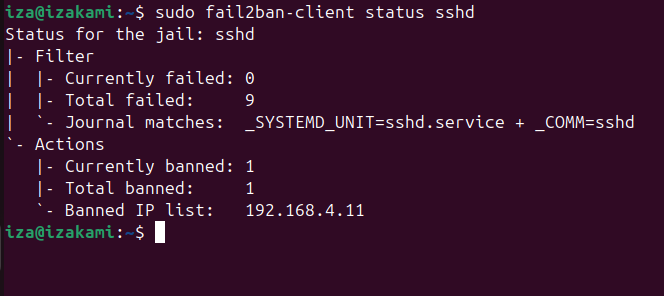

# 🛡️ Blue Team Defense Log: Incident Response Report
**System:** Ubuntu 24.04 LTS (Target)  
**Assigned Analyst:** iza  
**Status:** Completed & Mitigated  

---

## 1. Baseline Hardening & Service Configuration
The target machine was initially hardened by default. To simulate a realistic attack surface, the system was configured as follows:

* **Service:** OpenSSH Server (Port 22) enabled.
* **Firewall (UFW):** Configured to allow traffic specifically from the Kali Linux (Attacker) IP.
* **Intrusion Prevention:** Installed **Fail2Ban** to monitor authentication logs.

## 2. Detection of Reconnaissance (Nmap)
A network scan was detected originating from the Kali IP address.

* **Detection Method:** Kernel buffer monitoring (`dmesg`) and `auth.log` analysis.
* **Artifacts:** Identified "Connection reset by peer" patterns, indicating a service version scan (`nmap -sV`).

## 3. Intrusion Attempt Analysis (Brute Force)
A high-volume automated login attack was launched against the system.

### Evidence Artifacts (`/var/log/auth.log`)
```text
Dec 18 21:15:22 ubuntu sshd[1234]: Failed password for iza from 192.168.4.11 port 54322 ssh2
Dec 18 21:15:23 ubuntu sshd[1234]: Failed password for iza from 192.168.4.11 port 54324 ssh2
```
* **Tools Identified:** `Hydra`
* **Analysis:** Over 100 failed login attempts were recorded within a 60-second window, confirming a dictionary attack.

## 4. Active Defense & Mitigation
The **Fail2Ban** service successfully detected the pattern and triggered a block.

### IPS Action Summary
| Feature | Setting |
| :--- | :--- |
| **Max Retry Limit** | 3 attempts |
| **Ban Duration** | 1 Hour |
| **Action** | Dynamic REJECT rule in `nftables` |

### Visual Proof of Success (Screenshot)
Below is the verification showing the Kali IP address successfully placed in the Banned list.



## 5. Firewall Verification
To confirm the ban at the kernel level, the `nftables` ruleset was inspected:
```bash
sudo nft list ruleset | grep -A 10 "f2b-sshd"
```
The command confirmed a dynamic chain was created to drop all packets from the attacking source IP.
